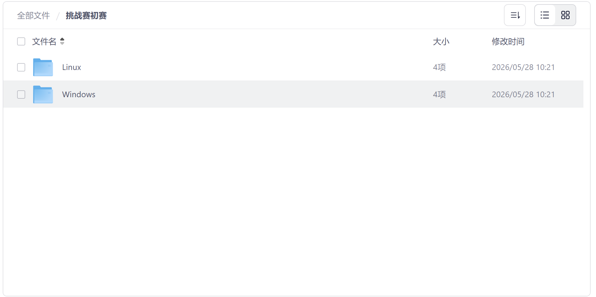
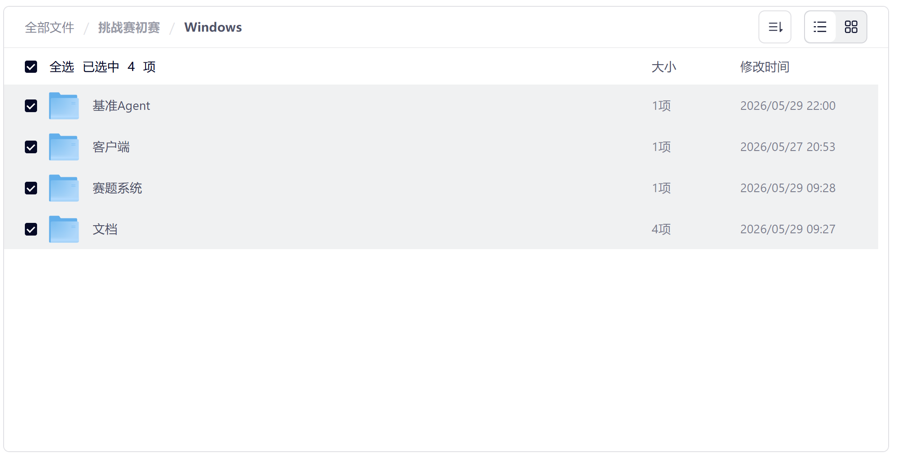

# 高校组：通用智能体任务挑战赛

通用智能体任务挑战赛面向通用智能体在具身仿真环境中的感知、决策与执行能力评测，参赛者需要构建能够完成指定任务的Agent。
本仓库提供比赛 baseline、运行脚本、模型配置和上手文档，帮助参赛者快速搭建环境、调试方案并提交结果。

## 比赛系统下载
- 完整比赛系统下载链接
  - 夸克网盘：https://pan.quark.cn/s/b81737fe757a?pwd=8bcQ
  - 百度网盘：https://pan.baidu.com/s/1uvbGpc3UQIibR_RvJ9grBQ?pwd=bj6f

根据你的系统类型选择对应的比赛系统进行下载，不支持MacOS

## 比赛系统说明
1. 系统支持Windows和Linux平台，位于Linux目录和Windows目录，如图所示：

请根据你的电脑类型下载对应比赛系统，不支持MacOS。

1. 比赛系统包含基准Agent代码、仿真客户端、赛题系统、文档，如图所示

- 基准Agent：就是本仓库代码，提供比赛baseline，帮助选手快速上手比赛，获得比赛结果。
- 客户端：比赛需要的具身仿真环境
- 赛题系统：负责向智能体出题，并评判最终结果
- 文档：比赛系统说明文档

## 如何开始？
开始前你需要将比赛系统下载到本地，并仔细阅读下载资料文档中的《【挑战赛】初赛系统使用指南.pdf》，根据指南运行比赛系统和baseline agent。

## 进一步阅读

下载资料文档中的《ArenaAgentPro上手指南》包含完整上手指南，包含 Agent 工作流程、感知层、动作层、Prompt 调试和提分思路，参赛同学请重点阅读。

## 声明
我们不强制要求必须使用大模型，你可以使用任意算法实现任务。
